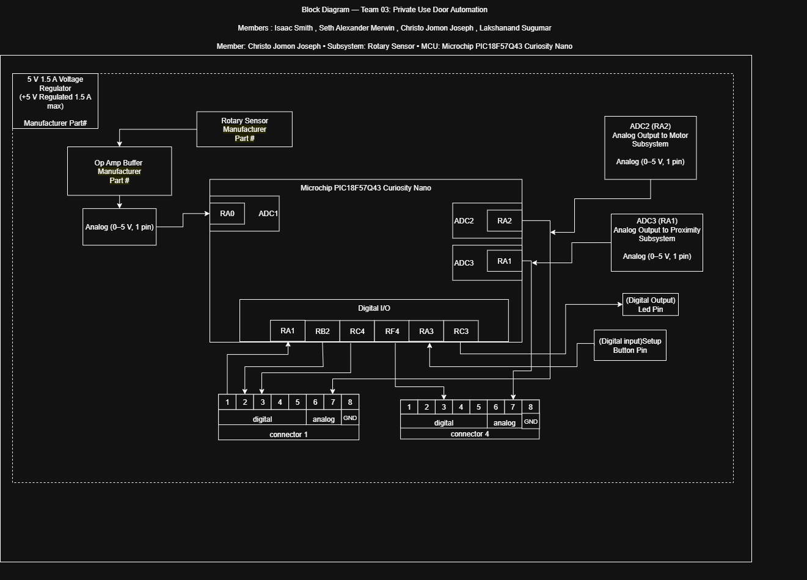

**Subsystem:** Rotary Sensor  
**MCU:** Microchip PIC18F57Q43 Curiosity Nano  
**Project:** Private Use Door Automation  

---

## Overview
This block diagram shows the electrical layout of my **Rotary Sensor subsystem**, which measures the door’s rotation angle and shares that information with other team subsystems.

It highlights:

- **Power Levels:** All components are powered from a regulated **+5 V 1.5 A supply** provided by the team’s shared power source.
- **Rotary Sensor:** KY-040 rotary encoder 
- **Microcontroller:** The Microchip PIC18F57Q43 Curiosity Nano receives digital signals from the rotary encoder through Channel A (RB0) and Channel B (RB3) to determine the door’s rotation direction and position.
The controller also uses DAC to convert the Digital signals from the rotary encoder to send analog outputs to the motor and proximity subsystems for synchronized control and calibration.
- **Actuators:** The subsystem includes a Red LED (RC3) to indicate calibration status and a Setup Button (RD7) for initialization.
- **Team Connections:**  
  - **RB2 :**  Tells Rotary Sensor that the Motor is on.
  - **RB1 :**  Tells Motor that it needs to move for the set up.
  - **RC4 :**  Tells Motor that it needs to move or stop during regular use.
  - **RF4 :** Connects Rotary encoder to IR subsystem for calibration.
  - **RC2 :** Connects Rotary Sensor to Felx subsystem to start calibration.
  - **RA2 :** Connects Rotary sensor to Flex subsystem for cross check while door is in motion.
  - **RA2 :** Connects Rotary encoder to the proximity subsystem for cross check while door is in motion.

---

## Block Diagram

---
# Part Importance

| Part            | Importance |
|-----------------|------------|
| Microcontroller | Acts as the main controller for the subsystem. It interprets rotary encoder feedback and manages door movement and system behavior. |
| Rotary Encoder  | Provides precise rotational feedback, allowing the system to determine the door’s exact position at all times. |
| LED             | Serves as a status indicator by showing whether the door is fully open or fully closed. |
| Switch Button   | Used to transition between calibration mode and normal mode|
---

## Access & Downloads

Access the draw.io in Google Drive **[here](https://drive.google.com/file/d/13LKkwTJjgqqxmauylCVNC0H4SzO0dGRc/view?usp=sharing)**.

To download the Block Diagram PNG click **[here](individual-block-diagram.png)**
