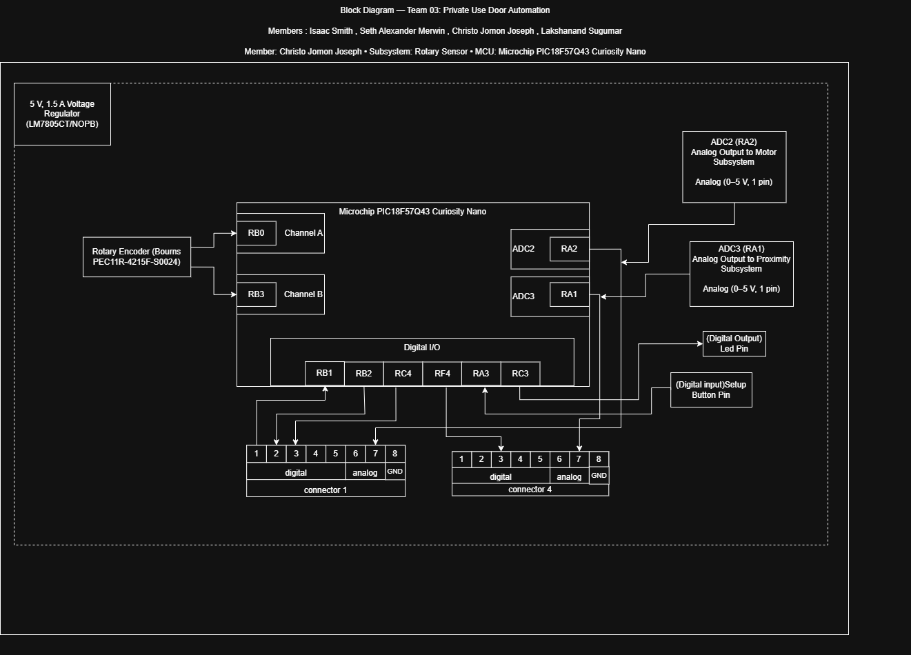

**Subsystem:** Rotary Sensor  
**MCU:** Microchip PIC18F57Q43 Curiosity Nano  
**Project:** Private Use Door Automation  

---

## Overview
This block diagram shows the electrical layout of my **Rotary Sensor subsystem**, which measures the door’s rotation angle and shares that information with other team subsystems.

It highlights:

- **Power Levels:** All components are powered from a regulated **+5 V 1.5 A supply** provided by the team’s shared power source.
- **Rotary Sensor:** P0915N-FC15BR10K (Rotary Potentiometer). 
- **Microcontroller:** The PIC18F57Q43 reads the analog voltage using ADC1 (RA0). Two additional ADC pins (ADC2–RA2 and ADC3–RA1) send analog outputs to the motor and proximity subsystems for coordinated motion control and calibration.
- **Actuators:** The subsystem includes a Blue LED (RC3) to indicate calibration status and a Setup Button (RA3) for initialization.
- **Team Connections:**  
  - **Connector 2 → Motor Subsystem:** Transmits analog angle feedback (ADC2).  
  - **Connector 4 → Proximity Subsystem:** Sends analog setup reference (ADC3).  
- **Power Source:** ---

---

## Block Diagram

## Access & Downloads

Access the draw.io in Google Drive **[here](https://drive.google.com/file/d/13LKkwTJjgqqxmauylCVNC0H4SzO0dGRc/view?usp=sharing)**.

To download the Block Diagram PNG click **[here](individual-block-diagram.png)**
