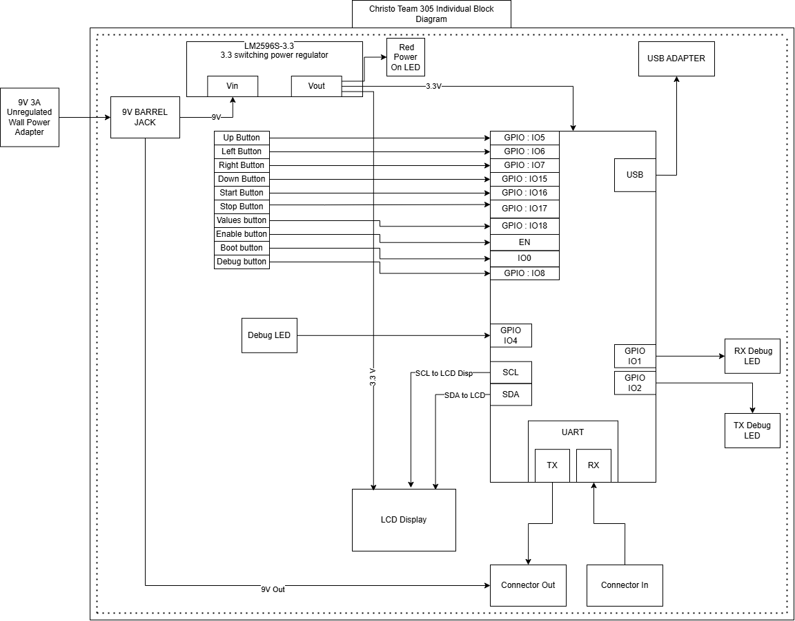

## Block Diagram

This block diagram shows the Human Machine Interface Device for Team 305, featuring an ESP32 as the central processor, an LCD interfaced via I2C, upstream and downstream headers for interconnection, a red LED output, and a 12V-to-3.3V power supply chain.

**Download:** [Download the PNG here](individual-block-diagram.png)
