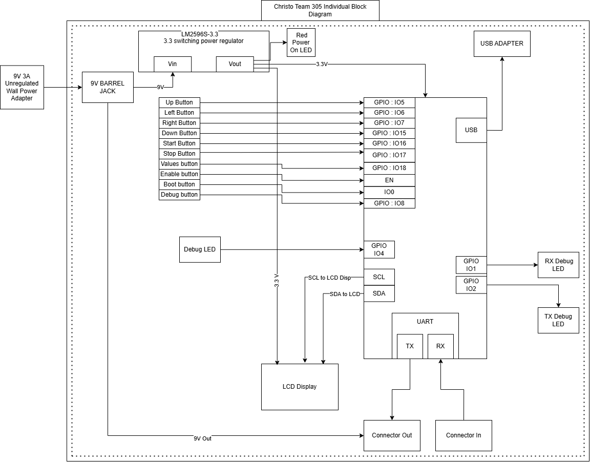

## Block Diagram

The HMI subsystem takes a 9V input through a barrel jack and steps it down to 3.3V using a LM2596S-3.3 switching regulator, which powers everything on the board. The ESP32-S3 sits at the center and handles all the inputs, eight navigation and control buttons feed directly into its GPIO pins. It drives a small 0.96 inch OLED over I2C and communicates with the rest of the robot through upstream and downstream connectors using UART.
 

**The file can be accessed on Google Drive** [here](https://drive.google.com/file/d/12LJq2xXBAQ1Vu3XaQUCN7chpNmku_BN_/view?usp=sharing).

**Download:** [Download the PNG here](individual-block-diagram.png)
