## Voltage Regulator (5 V, 1.5 A max)

### Option 1: LM340MPX-5.0/NOPB
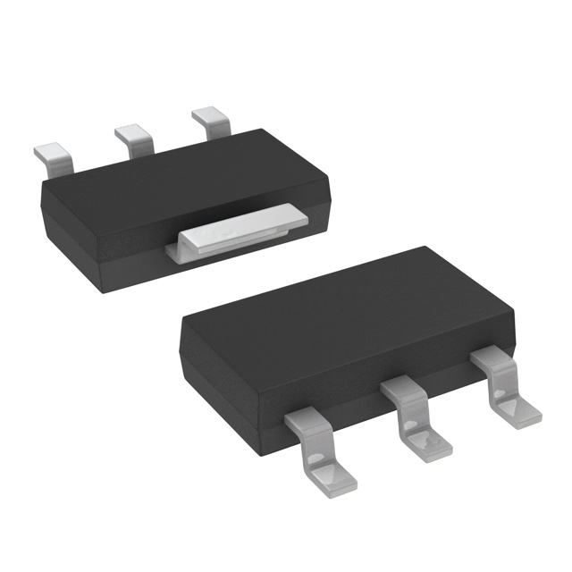

- $1.43 each  
- [link to product](https://www.digikey.com/en/products/detail/texas-instruments/LM340MPX-5-0-NOPB/367021)

**Pros**  
* Small size, good for tight PCBs  
* Same electrical specs as the 7805 family  

**Cons**  
* Not breadboard friendly  
* Needs copper area for heat dissipation  

---

### Option 2: LM7805CT/NOPB
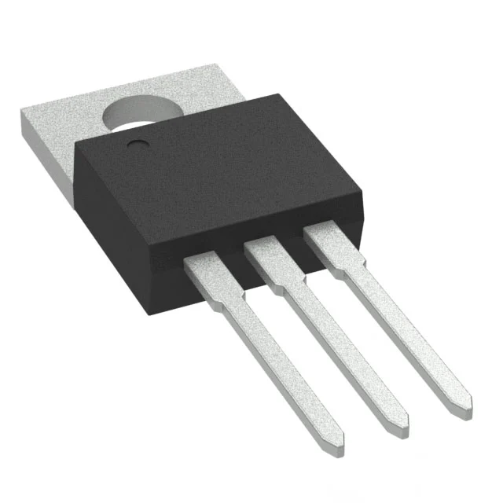

- $1.80 each  
- [link to product](https://www.digikey.com/en/products/detail/texas-instruments/LM7805CT-NOPB/3901929)

**Pros**  
* Easy to solder and prototype  
* Can add a clip-on heatsink for cooling  

**Cons**  
* Bulky package  
* Gets warm if you pull too much current  

---

### Option 3: LM7805SX/NOPB
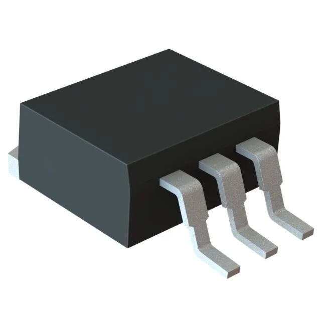

- $1.80 each  
- [link to product](https://www.digikey.com/en/products/detail/texas-instruments/LM7805SX-NOPB/6110585)

**Pros**  
* Good thermal performance for PCBs  
* Compact SMD design  

**Cons**  
* Needs thermal pad on PCB  
* Not for breadboard testing  

> **Choice:** Option 2 – LM7805CT/NOPB  
>
> **Rationale:** I picked the LM7805CT because it’s easy to mount and test on a breadboard and can handle more heat with a clip-on heatsink if needed.

## Op-Amp Buffer (Dual, 5 V Single Supply)

### Option 1: MCP6002-I/P
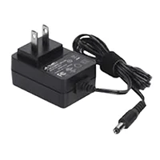

- $0.44 each  
- [link to product](https://www.digikey.com/en/products/detail/microchip-technology/MCP6002-I-P/500875)

**Pros**  
* Rail-to-rail input/output  
* Low power, works great at 5 V  

**Cons**  
* Not meant for high-speed signals  

---

### Option 2: LM358N/NOPB
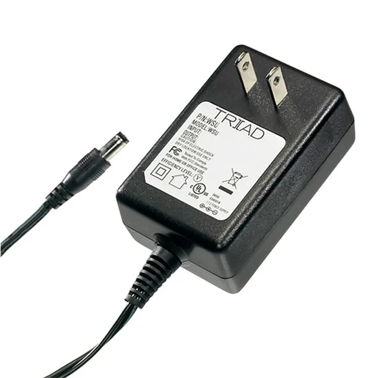

- $0.97 each  
- [link to product](https://www.digikey.com/en/products/detail/texas-instruments/LM358N-NOPB/6264)

**Pros**  
* Cheap and very common  
* Stable and easy to find  

**Cons**  
* Output doesn’t reach exact 0 V or 5 V  

---

### Option 3: TLV2462CP

- $3.14 each  
- [link to product](https://www.digikey.com/en/products/detail/texas-instruments/TLV2462CP/277537)

**Pros**  
* Fast and rail-to-rail output  
* Great for clean signal reads  

**Cons**  
* Costs more  
* Draws more current  

> **Choice:** Option 1 – MCP6002-I/P  
>
> **Rationale:** It’s rail-to-rail, runs on 5 V, and works perfectly as a buffer for my rotary sensor signal into the PIC ADC.

## Rotary Sensor (10 kΩ Linear Potentiometer)

### Option 1: P120PK-Y25BR10K
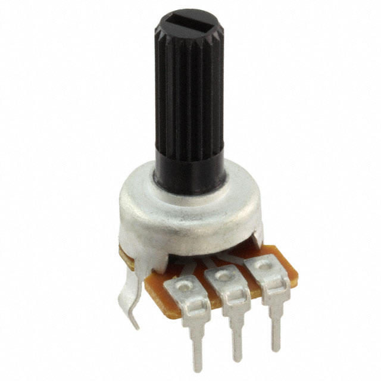

- $1.42 each  
- [link to product](https://www.digikey.com/en/products/detail/tt-electronics-bi/P120PK-Y25BR10K/5957454)

**Pros**  
* Compact and easy to mount  
* Smooth rotation and cheap  

**Cons**  
* Low power rating (only signal-level)  

---

### Option 2: P0915N-FC15BR10K
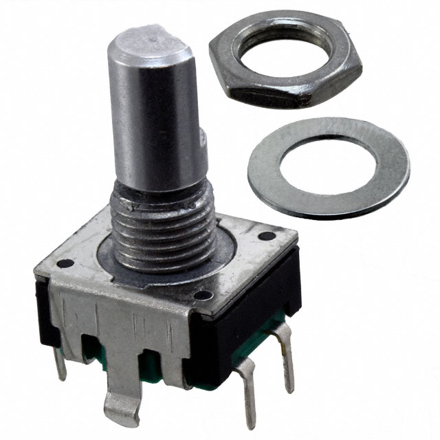

- $2.29 each  
- [link to product](https://www.digikey.com/en/products/detail/tt-electronics-bi/P0915N-FC15BR10K/4780740)

**Pros**  
* Panel-mount style with nut and washer  
* Feels smooth and durable  

**Cons**  
* Larger footprint  
* Same low power rating  

---

### Option 3: 3310Y-001-103L
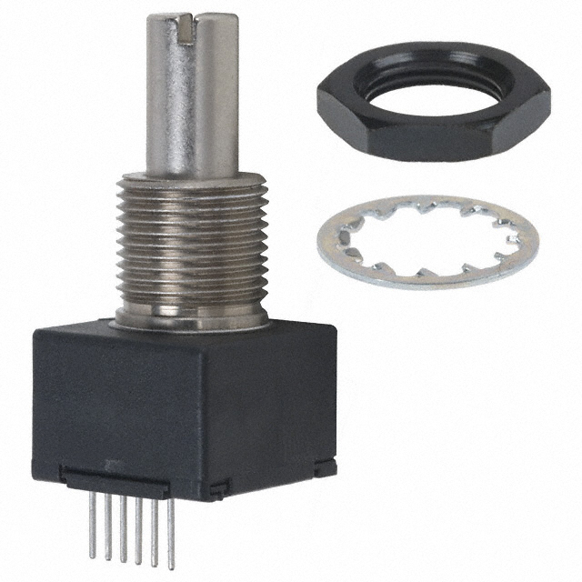

- $3.22 each  
- [link to product](https://www.digikey.com/en/products/detail/bourns-inc/3310Y-001-103L/1088215)

**Pros**  
* Higher 0.25 W rating and solid build  
* Trusted brand for sensors  

**Cons**  
* Bigger and more expensive  

> **Choice:** Option 2 – P0915N-FC15BR10K  
>
> **Rationale:** It fits our door automation setup best since it can mount to a panel and connect directly to the op-amp buffer and ADC.

## Setup Button (Digital Input)

### Option 1: B3F-1000
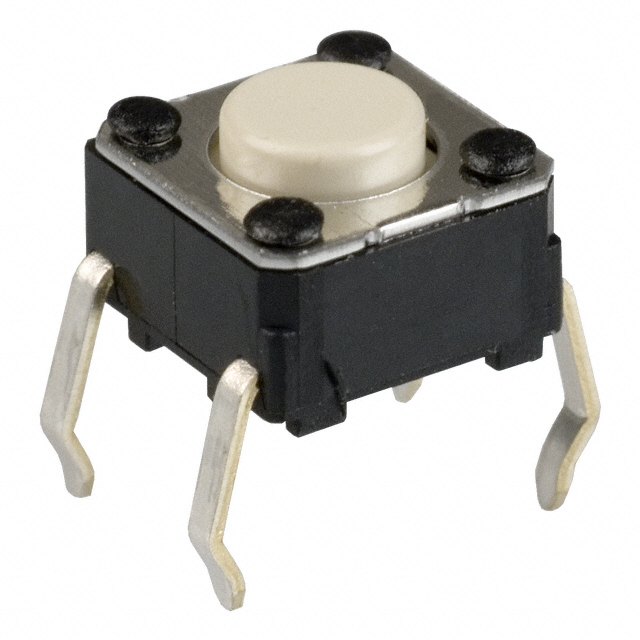

- $0.24 each  
- [link to product](https://www.digikey.com/en/products/detail/omron-electronics-inc-emc-div/B3F-1000/33150)

**Pros**  
* Very common and easy to use  
* Fits breadboard and PCB  

**Cons**  
* Short travel press  
* Not panel mount  

---

### Option 2: TL1100F160Q
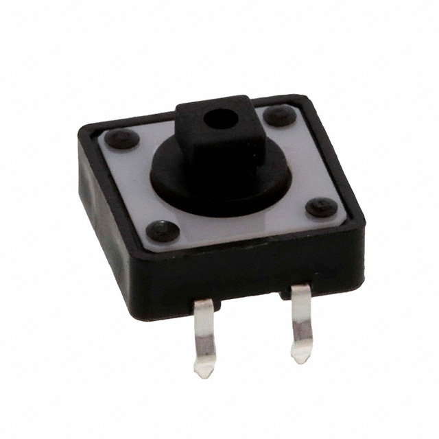

- $0.56 each  
- [link to product](https://www.digikey.com/en/products/detail/e-switch/TL1100F160Q/59082)

**Pros**  
* Cheap and easy backup for B3F  
* Comes in different heights  

**Cons**  
* Still a board-mount only switch  

---

### Option 3: TL1105BF160Q
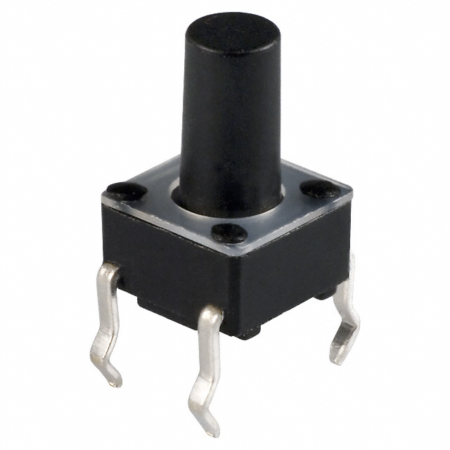

- $0.20 each  
- [link to product](https://www.digikey.com/en/products/detail/e-switch/TL1105BF160Q/1358)

**Pros**  
* Standard 6×6 mm board-mount size  
* Good life cycle (100 000 actuations)  

**Cons**  
* 160 gf force – might feel a bit stiff  
* Only 0.05 A @ 12 V contact rating  

> **Choice:** Option 1 – B3F-1000  
>
> **Rationale:** Reliable and easy to mount for testing. Pairs well with the PIC’s internal pull-up input setup.

## LED Indicator (Digital Output)

### Option 1: WP7113ID
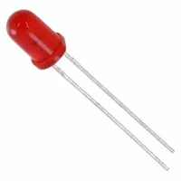

- $0.21 each  
- [link to product](https://www.digikey.com/en/products/detail/kingbright/WP7113ID/1747663)

**Pros**  
* Bright and easy to see  
* Standard 5 mm size  

**Cons**  
* Narrower viewing angle  

---

### Option 2: WP7113GD
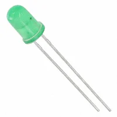

- $0.21 each  
- [link to product](https://www.digikey.com/en/products/detail/kingbright/WP7113GD/1747662)

**Pros**  
* Same package as the red one  
* Good brightness for indicators  

**Cons**  
* Slightly higher forward voltage  

---

### Option 3: VCC 200-BG

- $1.13 each
- [link to product](https://www.digikey.com/en/products/detail/visual-communications-company/vcc/200-BG/8656282)

**Pros**  
* Diffused lens gives softer, even light  
* Good visibility in normal ambient light  

**Cons**  
* Green LED forward voltage a bit higher than red  
* Not ultra-low brightness – might be overkill if you want subtle indicators  

> **Choice:** Option 1 – WP7113ID  
>
> **Rationale:** Red diffused LED is bright and clear for testing the PIC’s digital output pin with a 220 Ω series resistor.
