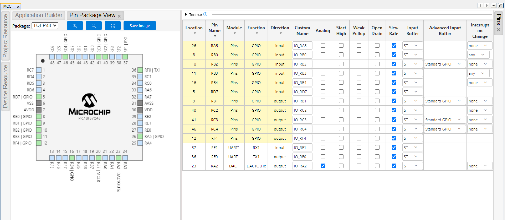

# Component Selection
This section involves successfully selecting the most suitable rotary encoder that fits my team's goals.

---

## Rotary Sensor (Rotary Encoder)

The encoder gives angle feedback so the system knows when the door is at 0° and 90°.  
It must send clean signals and last through repeated cycles.  
Accurate angle detection is a requirement for proper door motion control.

---

### Option 1: Bourns EM14R0D-R20-L064S (FINAL CHOICE)
{style="max-height:200px;"}

- **$31.31 each**  
- [EM14R0D-R20-L064S – Bourns 64-Position Encoder](https://www.digikey.com/en/products/detail/bourns-inc/EM14R0D-R20-L064S/2538006)

**Pros**  
* 64 resolution steps  
* Gold plated contacts  
* Long shaft  
* High durability  
* Smooth rotation  
* Clean quadrature signals  

**Cons**  
* Higher price  
* Larger size  

**Why this matters**  
High resolution and clean quadrature output are needed so the PIC can detect angles accurately.  
This meets the requirement for precise door position tracking.

---

### Option 2: Bourns PEC11R-4215F-S0024
{style="max-height:200px;"}

- **$2.2 each**  
- [PEC11R-4215F-S0024 – Bourns](https://www.digikey.com/en/products/detail/bourns-inc/PEC11R-4215F-S0024/4499665)

**Pros**  
* Common encoder choice  
* 24 detents  
* Clean quadrature  

**Cons**  
* Lower resolution  
* Shorter shaft  
* Not as durable  

**Why this matters**  
Lower resolution may reduce accuracy when detecting door endpoints.  
This does not fully support the precision needed for 0° and 90° detection.

---

### Option 3: KY-040 Rotary Encoder Module
{style="max-height:200px;"}

- **~$1.85 each**  
- [KY-040 Module](https://www.amazon.com/Cylewet-Encoder-15%C3%9716-5-Arduino-CYT1062/dp/B06XQTHDRR)

**Pros**  
* Easy to test  
* 5 V logic  
* Has small PCB  

**Cons**  
* Noisy signal  
* Low accuracy  
* Not good for final systems  

**Why this matters**  
Noisy output leads to inaccurate angle readings.  
This fails the requirement for consistent and reliable door position feedback.

---

> ## Final Choice  
> **Bourns EM14R0D-R20-L064S**  
>  
> The system needs accurate angle detection and the EM14 provides clean quadrature transitions with 64 steps.  
> It handles repeated door cycles without wearing out and the long shaft helps with mounting.  
> Signal quality stays stable so the PIC reads angles correctly.  
>  
> **Why this fits the requirements**  
> The project requires reliable angle detection for 0° and 90° stopping.  
> The EM14 provides the accuracy and durability required for long term operation.

---

## Final Selection Table

| Function        | Part Name |
|----------------|-----------|
| Rotary Encoder | [EM14R0D-R20-L064S](https://www.digikey.com/en/products/detail/bourns-inc/EM14R0D-R20-L064S/2538006) |

## MCC Configuration / Pinout Table 

| Subsystem | Pins |
|-----------|-------|
| DAC       | RA2 |
| UART      | RF1 (RX1), RF0 (TX1) |
| GPIO      | RA5, RB0, RB1, RB2, RB3, RC2, RC3, RC4, RD4, RD7, RF4 |

