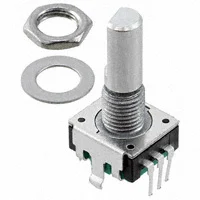
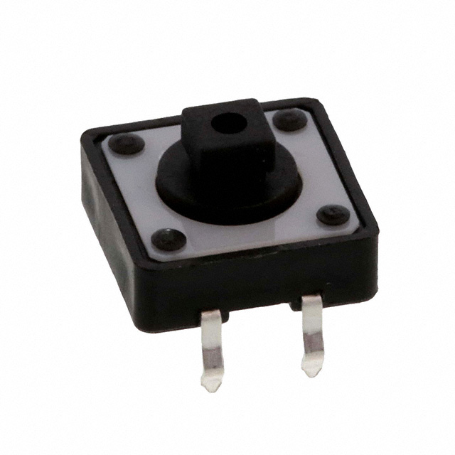

## Voltage Regulator (5 V, 1.5 A max)

### Option 1: LM340MPX-5.0/NOPB

- $1.43 each  
- [link to product](https://www.digikey.com/en/products/detail/texas-instruments/LM340MPX-5-0-NOPB/367021)

**Pros**  
* Small size, good for tight PCBs  
* Same electrical specs as the 7805 family  

**Cons**  
* Not breadboard friendly  
* Needs copper area for heat dissipation  

---

### Option 2: LM7805CT/NOPB

- $1.80 each  
- [link to product](https://www.digikey.com/en/products/detail/texas-instruments/LM7805CT-NOPB/3901929)

**Pros**  
* Easy to solder and prototype  
* Can add a clip-on heatsink for cooling  

**Cons**  
* Bulky package  
* Gets warm if you pull too much current  

---

### Option 3: LM7805SX/NOPB

- $1.80 each  
- [link to product](https://www.digikey.com/en/products/detail/texas-instruments/LM7805SX-NOPB/6110585)

**Pros**  
* Good thermal performance for PCBs  
* Compact SMD design  

**Cons**  
* Needs thermal pad on PCB  
* Not for breadboard testing  

> **Choice:** Option 2 – LM7805CT/NOPB  
>
> **Rationale:** I picked the LM7805CT because it’s easy to mount and test on a breadboard and can handle more heat with a clip-on heatsink if needed.

## Rotary Sensor (Rotary Encoder)

### Option 1: Bourns PEC11R-4220F-S0024

- $1.89 each  
- [link to product](https://www.digikey.com/en/products/detail/bourns-inc/PEC11R-4220F-S0024/4699220)

**Pros**  
* Low-cost incremental quadrature encoder  
* Same pin layout as other PEC11R models  

**Cons**  
* Weaker shaft support  
* Shorter mechanical life  

---

### Option 2: Bourns PEC11R-4215K-N0024

- $1.89 each  
- [link to product](https://www.digikey.com/en/products/detail/bourns-inc/PEC11R-4215K-N0024/4699218)

**Pros**  
* Cheapest variant  
* Compatible footprint  

**Cons**  
* Lower detent torque and shorter lifespan  
* Slightly rougher feel when rotating  

---

### Option 3: Bourns PEC11R-4215F-S0024

- $2.18 each  
- [link to product](https://www.digikey.com/en/products/detail/bourns-inc/PEC11R-4215F-S0024/4699227)

**Pros**  
* Reliable, high-quality encoder from Bourns  
* Smooth feel with 24 detents per revolution  
* Ideal for microcontroller interfacing at 5 V  

**Cons**  
* Slightly higher cost than cheaper variants  

> **Choice:** Option 3 – Bourns PEC11R-4215F-S0024  
>
> **Rationale:** This encoder offers stable quadrature output, long mechanical life, and excellent build quality for consistent position feedback in the door automation system.

## Setup Button (Digital Input)

### Option 1: B3F-1000

- $0.24 each  
- [link to product](https://www.digikey.com/en/products/detail/omron-electronics-inc-emc-div/B3F-1000/33150)

**Pros**  
* Very common and easy to use  
* Fits breadboard and PCB  

**Cons**  
* Short travel press  
* Not panel mount  

---

### Option 2: TL1100F160Q

- $0.56 each  
- [link to product](https://www.digikey.com/en/products/detail/e-switch/TL1100F160Q/59082)

**Pros**  
* Cheap and easy backup for B3F  
* Comes in different heights  

**Cons**  
* Still a board-mount only switch  

---

### Option 3: TL1105BF160Q

- $0.20 each  
- [link to product](https://www.digikey.com/en/products/detail/e-switch/TL1105BF160Q/1358)

**Pros**  
* Standard 6×6 mm board-mount size  
* Good life cycle (100 000 actuations)  

**Cons**  
* 160 gf force – might feel a bit stiff  
* Only 0.05 A @ 12 V contact rating  

> **Choice:** Option 1 – B3F-1000  
>
> **Rationale:** Reliable and easy to mount for testing. Pairs well with the PIC’s internal pull-up input setup.

## LED Indicator (Digital Output)

### Option 1: WP7113ID

- $0.21 each  
- [link to product](https://www.digikey.com/en/products/detail/kingbright/WP7113ID/1747663)

**Pros**  
* Bright and easy to see  
* Standard 5 mm size  

**Cons**  
* Narrower viewing angle  

---

### Option 2: WP7113GD

- $0.21 each  
- [link to product](https://www.digikey.com/en/products/detail/kingbright/WP7113GD/1747662)

**Pros**  
* Same package as the red one  
* Good brightness for indicators  

**Cons**  
* Slightly higher forward voltage  

---

### Option 3: VCC 200-BG

- $1.13 each  
- [link to product](https://www.digikey.com/en/products/detail/visual-communications-company/vcc/200-BG/8656282)

**Pros**  
* Diffused lens gives softer, even light  
* Good visibility in normal ambient light  

**Cons**  
* Green LED forward voltage a bit higher than red  

> **Choice:** Option 1 – WP7113ID  
>
> **Rationale:** Red diffused LED is bright and clear for testing the PIC’s digital output pin with a 220 Ω series resistor.
