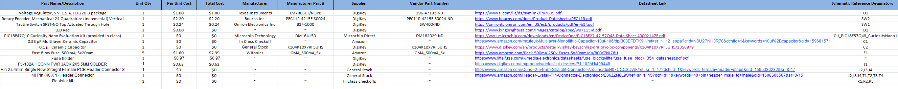

## Overview
In the Bill of Materials, I selected components that were similar to the ones used in class to ensure compatibility and reliability except the rotary encoder of course. All parts were chosen from DigiKey because they provide detailed datasheets and verified specifications. This made it easier to confirm performance and quality while keeping the design aligned with the course requirements.

## Bill of Materials 
{style width: "2000"}
**Figure 2:** Bill of Materials

An Excel sheet of the Bill of Materials can be downloaded  [*here*](Christo-BOM.xlsx)

