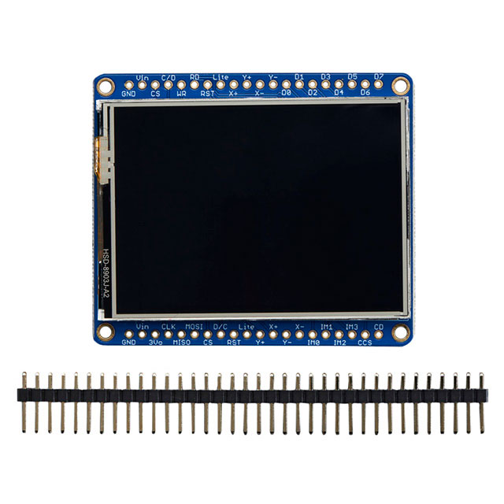
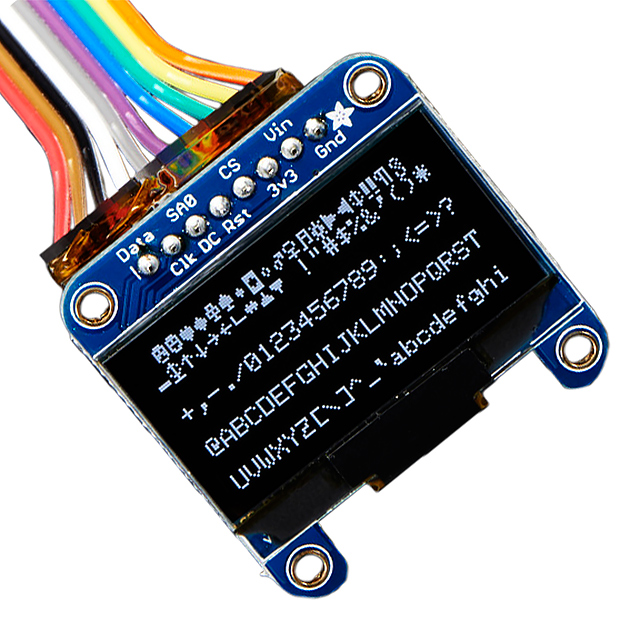

## Major Components

These are the parts selected for the main parts on the HMI board.

## 3.3V Power Regulator

1. LM2596S-3.3 - 3A Switching Regulator

    

    * ~$8.76
    * [DigiKey Link](https://www.digikey.com/en/products/detail/texas-instruments/LM2596S-3-3/3701219)

    | Pros                                      | Cons                                                             |
    | ----------------------------------------- | ---------------------------------------------------------------- |
    | Handles 3A which is way more than ESP32 needs | Takes up more board space (TO-263 package) |
    | Switching design stays cool and efficient | Needs extra parts like inductors and caps |
    | Works with 9V input from our power supply | More complex circuit design |
    | Doesn't waste power as heat |  |

2. AMS1117-3.3 - 1A Linear Regulator

    

    * ~$0.29
    * [DigiKey Link](https://www.digikey.com/en/products/detail/umw/AMS1117-3-3/17635254)

    | Pros                                      | Cons                                                             |
    | ----------------------------------------- | ---------------------------------------------------------------- |
    | Super cheap and easy to find | Gets hot with big voltage drops |
    | Simple circuit with just a couple caps | Only handles 1A max current |
    | Common on ESP32 boards already | Wastes power as heat (not efficient) |
    | SOT-223 package is small |  |

3. AP2112K-3.3 - 600mA Low Dropout Regulator

    

    * ~$0.22
    * [DigiKey Link](https://www.digikey.com/en/products/detail/diodes-incorporated/AP2112K-3-3TRG1/4470746)

    | Pros                                      | Cons                                                             |
    | ----------------------------------------- | ---------------------------------------------------------------- |
    | Really cheap at under 50 cents | **Only 600mA might be tight for ESP32 with display** |
    | Tiny SOT-25 package saves board space | Lower current limit than other options |
    | Low dropout means works with lower input voltage | Linear regulator so still wastes some power |
    | Good for low power stuff |  |

**Choice:** Option 1 - LM2596S-3.3 Switching Regulator

> **Rationale:** The LM2596S-3.3 can handle 3A which gives us plenty of headroom for the ESP32 plus the TFT LCD backlight and any extras. Since we're coming from a 9V supply the switching design keeps things efficient and doesn't turn all that voltage drop into heat like the linear regulators do. Yeah it needs more external components and takes up more board space but for a safety board that's monitoring power and running the HMI we want something reliable that won't overheat. The AMS1117 is tempting because it's cheap and simple but it'll get pretty hot stepping down from 9V to 3.3V especially if the ESP32 is doing WiFi stuff. The AP2112K is too limited at 600mA since the ESP32 can pull spikes above that when transmitting and we've got the TFT pulling current for the backlight too.

## HMI Display

1. SparkFun COM-28380 - 3.2" Color TFT Touchscreen (ILI9341)

    

    * $19.95
    * [DigiKey Link](https://www.digikey.com/en/products/detail/sparkfun-electronics/COM-28380/26523962)

    | Pros                                      | Cons                                                             |
    | ----------------------------------------- | ---------------------------------------------------------------- |
    | Bigger at 3.2" so more room for rover data | SPI uses 5 pins instead of 2 for I2C |
    | Color display for status (red errors, green good, yellow warnings) | Draws more current than OLED |
    | 320x240 resolution fits lots of info | Takes up more board space |
    | Touchscreen so we can ditch some buttons |  |
    | Same price as smaller displays |  |
    | ILI9341 chip works great with ESP32 |  |

2. Adafruit 2478 - 2.4" TFT LCD with Touchscreen (ILI9341)

    

    * $29.95
    * [DigiKey Link](https://www.digikey.com/en/products/detail/adafruit-industries-llc/2478/5761253)

    | Pros                                      | Cons                                                             |
    | ----------------------------------------- | ---------------------------------------------------------------- |
    | Color display makes status way clearer | More expensive at $30 |
    | 240x320 pixels gives room for info | Smaller than SparkFun at 2.4" |
    | Good Adafruit libraries and support | Uses more power than OLED |
    | MicroSD slot for logging |  |

3. Adafruit 938 - 1.3" Monochrome OLED (SSD1306)

    

    * $19.95
    * [DigiKey Link](https://www.digikey.com/en/products/detail/adafruit-industries-llc/938/5774238)

    | Pros                                      | Cons                                                             |
    | ----------------------------------------- | ---------------------------------------------------------------- |
    | High contrast monochrome is easy to read | Only black and white so can't color-code status |
    | Uses way less power than TFT | Tiny at 1.3" and only 128x64 pixels |
    | I2C only needs 2 pins | Hard to fit rover data plus menus on small screen |
    | STEMMA QT makes wiring clean |  |

**Choice:** Option 1 - SparkFun COM-28380 3.2" Color TFT

> **Rationale:** The SparkFun 3.2" display is the sweet spot - bigger screen than the Adafruit 2.4" but same price at $20.  The ILI9341 controller has tons of ESP32 libraries and examples so getting it running is easy. Touchscreen means we can do a better UI than just buttons. Yeah SPI takes more pins than I2C but the ESP32 has GPIO to spare.
