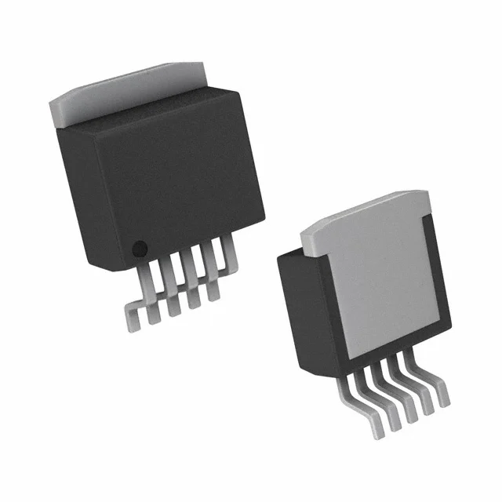
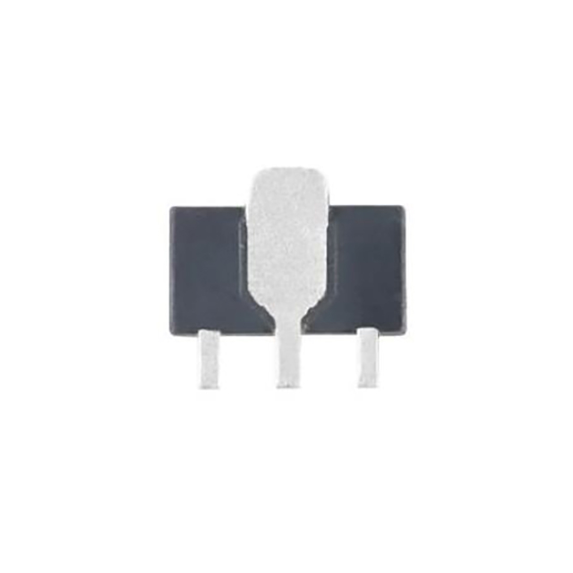
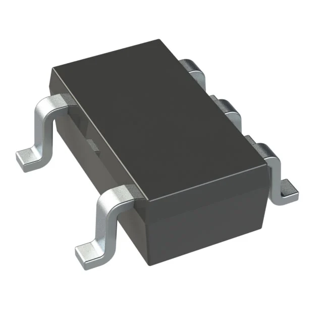
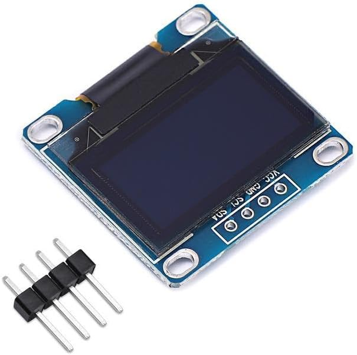
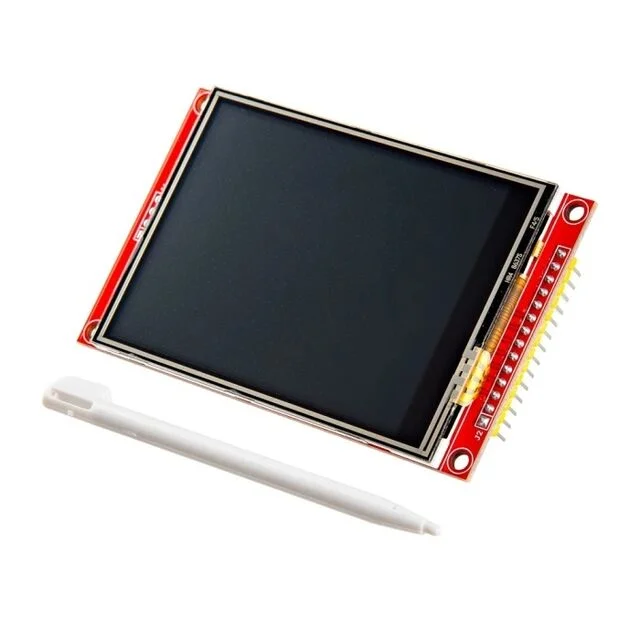
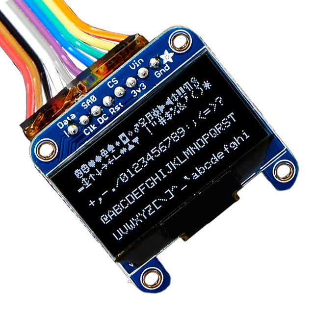

## Major Components

These are the parts selected for the main parts on the HMI board.

## 3.3V Power Regulator

1. LM2596S-3.3 - 3A Switching Regulator

    

    * ~$8.76
    * [DigiKey Link](https://www.digikey.com/en/products/detail/texas-instruments/LM2596S-3-3/3701219)

    | Pros                                      | Cons                                                             |
    | ----------------------------------------- | ---------------------------------------------------------------- |
    | Handles 3A which is way more than ESP32 needs | Takes up more board space (TO-263 package) |
    | Switching design stays cool and efficient | Needs extra parts like inductors and caps |
    | Works with 9V input from our power supply | More complex circuit design |
    | Doesn't waste power as heat |  |

2. AMS1117-3.3 - 1A Linear Regulator

    

    * ~$0.29
    * [DigiKey Link](https://www.digikey.com/en/products/detail/umw/AMS1117-3-3/17635254)

    | Pros                                      | Cons                                                             |
    | ----------------------------------------- | ---------------------------------------------------------------- |
    | Super cheap and easy to find | Gets hot with big voltage drops |
    | Simple circuit with just a couple caps | Only handles 1A max current |
    | Common on ESP32 boards already | Wastes power as heat (not efficient) |
    | SOT-223 package is small |  |

3. AP2112K-3.3 - 600mA Low Dropout Regulator

    

    * ~$0.22
    * [DigiKey Link](https://www.digikey.com/en/products/detail/diodes-incorporated/AP2112K-3-3TRG1/4470746)

    | Pros                                      | Cons                                                             |
    | ----------------------------------------- | ---------------------------------------------------------------- |
    | Really cheap at under 50 cents | **Only 600mA might be tight for ESP32 with display** |
    | Tiny SOT-25 package saves board space | Lower current limit than other options |
    | Low dropout means works with lower input voltage | Linear regulator so still wastes some power |
    | Good for low power stuff |  |

**Choice:** Option 1 - LM2596S-3.3 Switching Regulator

> **Rationale:** The LM2596S-3.3 can handle 3A which gives us plenty of headroom for the ESP32 plus the TFT LCD backlight and any extras. Since we're coming from a 9V supply the switching design keeps things efficient and doesn't turn all that voltage drop into heat like the linear regulators do. Yeah it needs more external components and takes up more board space but for a safety board that's monitoring power and running the HMI we want something reliable that won't overheat. The AMS1117 is tempting because it's cheap and simple but it'll get pretty hot stepping down from 9V to 3.3V especially if the ESP32 is doing WiFi stuff. The AP2112K is too limited at 600mA since the ESP32 can pull spikes above that when transmitting and we've got the TFT pulling current for the backlight too.

## HMI Display

1. Songhe 0.96" 128x64 OLED (SSD1306) - I2C

    

    * $2 each (sold in 5-packs, ~$10)
    * [Amazon Link](https://www.amazon.com/Songhe-0-96-inch-I2C-Raspberry/dp/B085WCRS7C/)

    | Pros                                      | Cons                                                             |
    | ----------------------------------------- | ---------------------------------------------------------------- |
    | I2C only needs 2 data pins (SDA + SCL) | Monochrome only, no color status indicators |
    | Very low power - OLED only lights active pixels | Tiny 0.96" screen limits how much info fits |
    | SSD1306 driver has excellent ESP32/Arduino library support | 128x64 resolution is limited compared to TFT options |
    | Extremely cheap and available in bulk | No touchscreen |
    | Same display used in EGR 314 coursework - already familiar |  |
    | Compact size fits neatly on the HMI board |  |

2. SparkFun COM-28380 - 3.2" Color TFT Touchscreen (ILI9341)

    

    * $19.95
    * [DigiKey Link](https://www.digikey.com/en/products/detail/sparkfun-electronics/COM-28380/26523962)

    | Pros                                      | Cons                                                             |
    | ----------------------------------------- | ---------------------------------------------------------------- |
    | Bigger at 3.2" so more room for rover data | SPI uses 5 pins instead of 2 for I2C |
    | Color display for status (red errors, green good, yellow warnings) | Draws more current than OLED |
    | 320x240 resolution fits lots of info | Takes up more board space |
    | Touchscreen so we can ditch some buttons |  |

3. Adafruit 938 - 1.3" Monochrome OLED (SSD1306)

    

    * $19.95
    * [DigiKey Link](https://www.digikey.com/en/products/detail/adafruit-industries-llc/938/5774238)

    | Pros                                      | Cons                                                             |
    | ----------------------------------------- | ---------------------------------------------------------------- |
    | High contrast monochrome is easy to read | Only black and white so can't color-code status |
    | Uses way less power than TFT | Tiny at 1.3" and only 128x64 pixels |
    | I2C only needs 2 pins | More expensive than the Songhe at $20 |
    | STEMMA QT makes wiring clean |  |

**Choice:** Option 1 - Songhe 0.96" OLED (SSD1306)

> **Rationale:** We used the exact same SSD1306-based 0.96" OLED display in our EGR 314 coursework, so the I already know how to wire it up and write code for it. That familiarity cuts development time significantly and reduces the chance of wiring mistakes. The I2C interface is a big win too only SDA and SCL are needed instead of the 5+ pins SPI displays require, which frees up GPIO on the ESP32. The SSD1306 also has mature, well-documented Arduino/ESP32 libraries (Adafruit SSD1306) that integrate easily with our existing code. Power draw is minimal since OLED only lights active pixels, keeping the overall board current budget comfortable. Yes, the screen is small and monochrome, but for displaying sensor readings and system status on an HMI board, 128x64 is sufficient. The TFT options (Options 2 and 3) offer color and larger screens but at the cost of more pins, more power, and more complex wiring: none of which benefit this project enough to justify switching away from a display we already know works.
