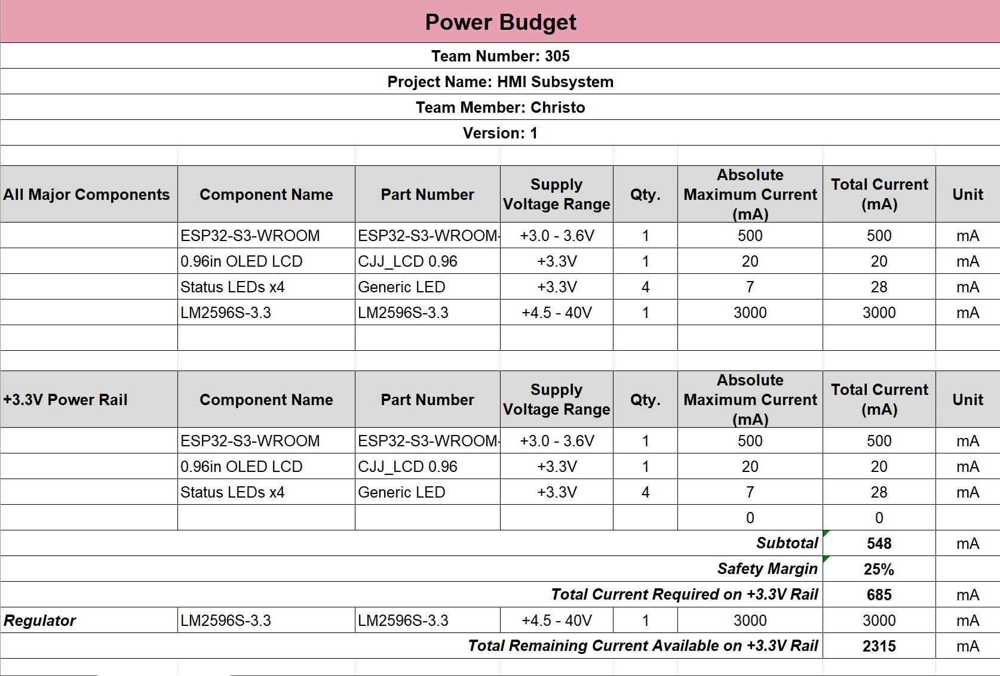
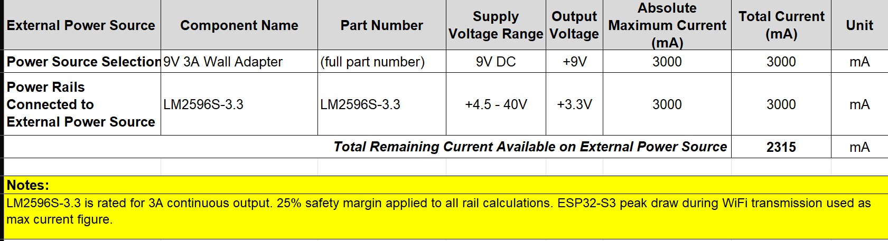

## Overview

A power budget was created to make sure the LM2596S-3.3 switching regulator can supply enough current to all components on the HMI board without hitting its limits. Each component's maximum current draw was pulled from its datasheet, totaled up, and then a 25% safety margin was applied to give the design room to breathe. The ESP32-S3 peak draw during WiFi transmission was used as the worst-case figure since that's when it pulls the most current.

## Conclusions

The +3.3V rail has a subtotal of 548mA across all components (ESP32-S3-WROOM at 500mA, 0.96" OLED at 20mA, and 4x status LEDs at 28mA). After applying the 25% safety margin, the total required current is 685mA. The LM2596S-3.3 is rated for 3000mA continuous output, leaving 2315mA of headroom on the rail, well within the regulator's capabilities. The 9V 3A wall adapter powering the system also has 2315mA remaining after the regulator's load, confirming the power supply chain is more than adequate for this design.

## Resources

The power budget as a PDF download is available [*here*](power-budget.pdf), and the Microsoft Excel sheet [*here*](Power-budget.xlsx).
