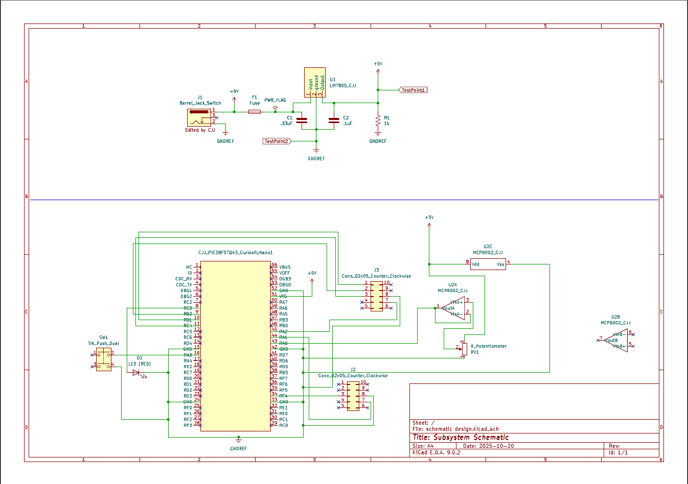

## Overview

This schematic supports the entire subsystem by providing power, control, and signal handling. The 9V input passes through a fuse and the LM7805 regulator to supply a stable 5V to all components. The PIC18F57Q43 Curiosity Nano controls the system, taking input from the potentiometer through the MCP6002 OP Amp and sends signals out through the ribbon cable connectors. LEDs and test points are included for easy debugging and power verification for a reliable operation of the circuit.

{style width:"350" height:"300;"}
**Figure 01:** Rotary subsystem schematic

## Resouces

The schematic as a PDF download is available [*here*](schematic-design.pdf), and the Zip folder of the project [*here*](schematic-design.zip).