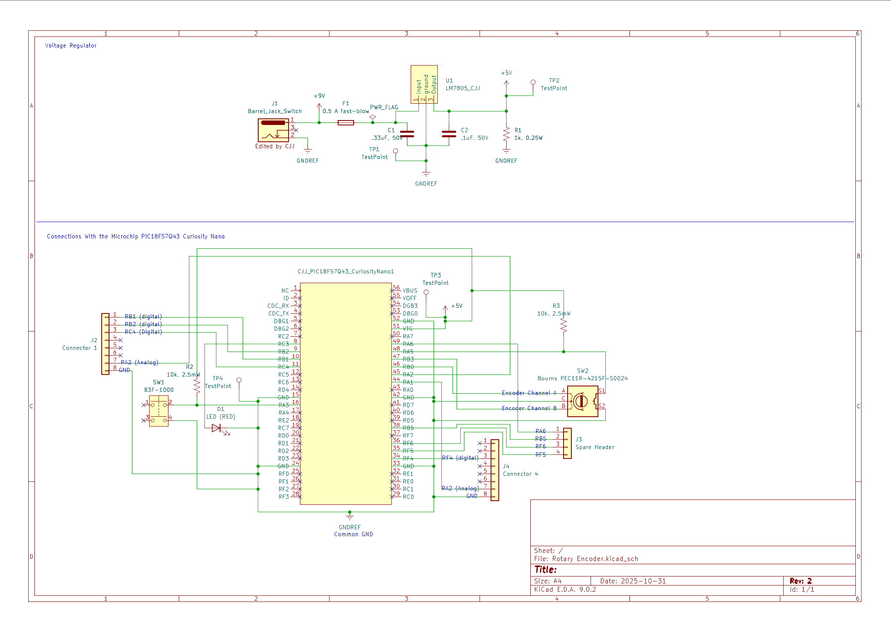

## Overview

This schematic keeps the rotary encoder subsystem powered, controlled, and connected. A 9 V input runs through a fuse and the LM7805 voltage regulator, giving a steady +5 V to both the PIC18F57Q43 Curiosity Nano and the Bourns PEC11R-4215F-S0024 rotary encoder.

The PIC18F57Q43 takes digital inputs from Channel A (RB0) and Channel B (RB3) to detect rotation and direction. It then sends analog outputs from RA2 (ADC2) and RA1 (ADC3) to the motor and proximity subsystems for smooth door movement and calibration.

A Red LED (RC3) shows calibration status, and a setup button (RA3) handles initialization. Test points are added for quick debugging and power checks, keeping the circuit easy to verify and reliable during operation.

**Figure 01:** Rotary subsystem schematic

## Resouces

The schematic as a PDF download is available [*here*](schematic-design.pdf), and the Zip folder of the project [*here*](schematic-design.zip).