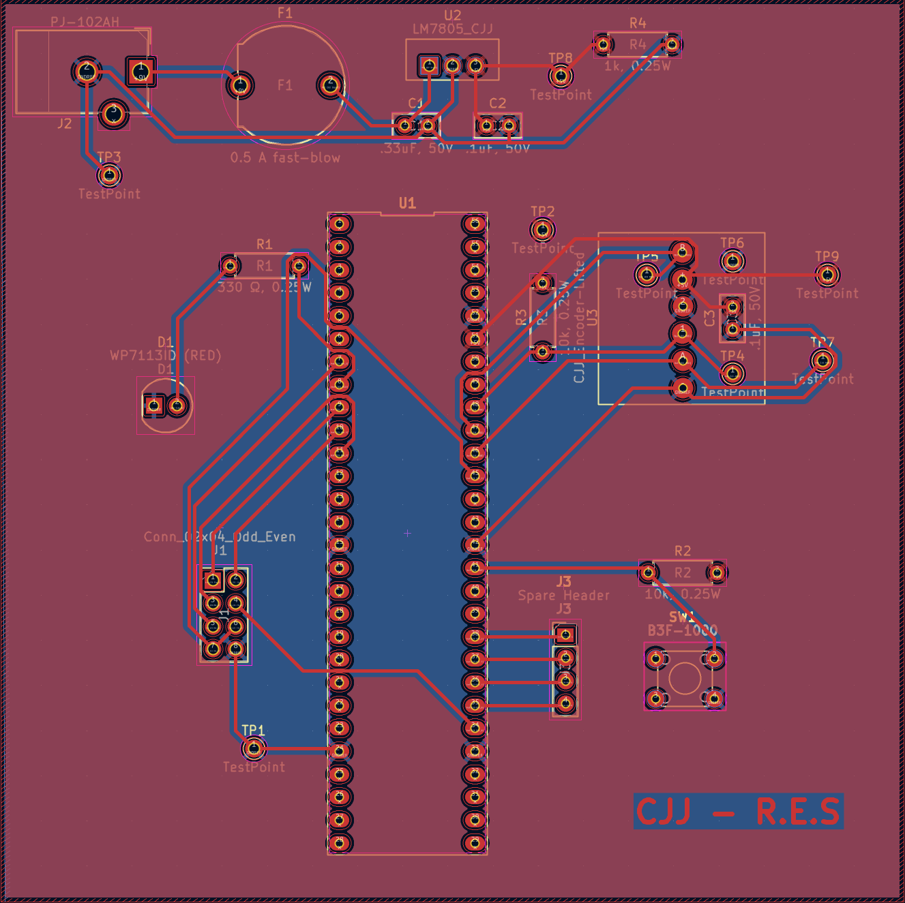
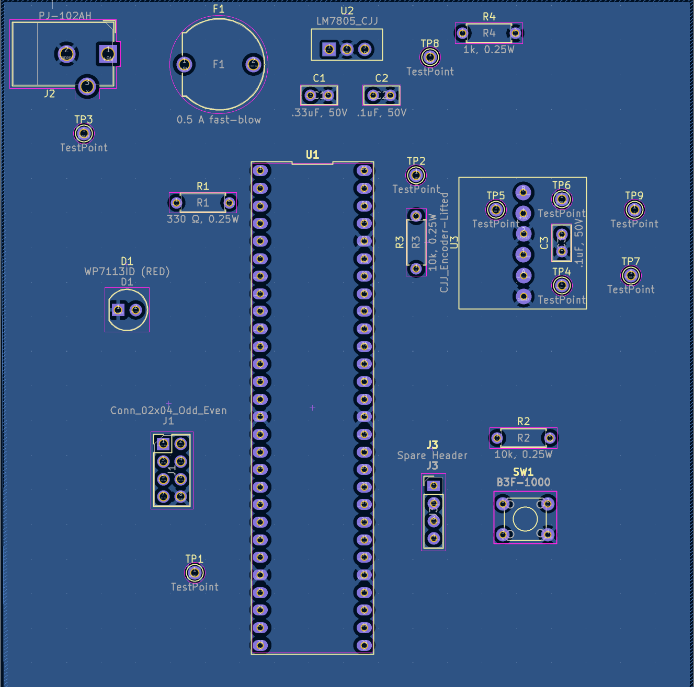

# PCB Images

## PCB Front and Back (Not Soldered)

**Figure 01:** Front of the unsoldered PCB

**Figure 02:** Back of the unsoldered PCB

---
## PCB Front and Back (Soldered)

**Figure 03:** Front of the soldered PCB

**Figure 04:** Back of the soldered PCB

---
## PCB ECAD Top and Bottom

**Figure 05:** Top Layer of the PCB

**Figure 06:** Bottom Layer of the PCB

---

# Resouces

The Top and Bottom Layer as a PDF download is available [*here*](PCB-top-bottom-CJJ.pdf), and the updated ECAD project .zip file [*here*](rotary-encoder.zip).

The Gerber Files for the PCB can be downloaded [*here*](Rotary-Encoder-Gerber-Files.zip)