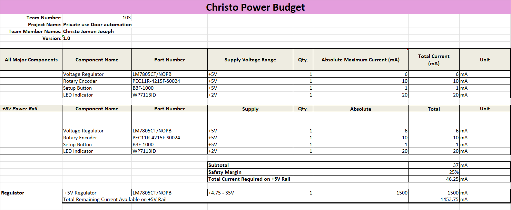

## Overview
I created this power budget to make sure my subsystem runs safely and efficiently without overloading the 5 V regulator. It lists all the components I’m actually using : the LM7805CT voltage regulator, PEC11R rotary encoder, B3F-1000 setup button, and WP7113ID LED.

Each component’s voltage and current were recorded and the total current draw was calculated. I then added a 25% safety margin to cover any unexpected power spikes or variations during operation.

This helps confirm that my subsystem stays within safe limits and the regulator can handle the load and everything works fine once powered up.

## Conclusions

From the prepared Power Budget, I confirmed that my subsystem runs safely within the limits of the 5 V regulator. I went through each component’s voltage and current needs to make sure nothing pulls too much power.

After adding everything up and applying the 25% safety margin, the numbers showed that there’s still plenty of current left for stable operation. This means the regulator can handle all my components without overheating or causing any voltage drops.

## Resouces

The power budget as a PDF download is available [*here*](Christo-power-budget.pdf), and a Microsoft Excel Sheet [*here*](Christo-power-budget.xlsx).