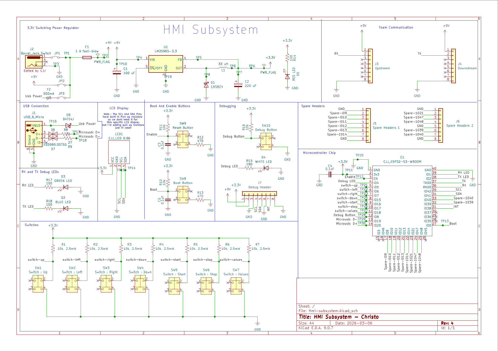

## Overview

This schematic covers the Human Machine Interface (HMI) subsystem for Team 305. The board is built around an **ESP32-S3-WROOM-1** microcontroller and handles user-facing display, input, and daisy-chain UART communication with the rest of the system.

**Figure 1:** HMI subsystem schematic

## Resources

The schematic as a PDF download is available [*here*](Hmi-subsystem.pdf), and the KiCad project zip is available [*here*](Hmi-subsystem.zip).
