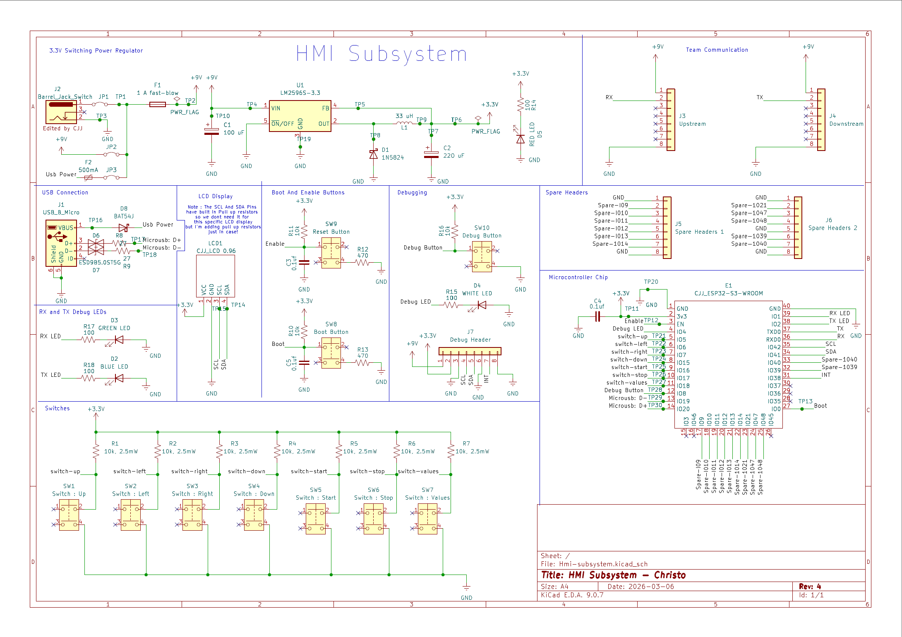

## Overview

This is the schematic for the HMI subsystem board for Team 305. The whole thing is built around the **ESP32-S3-WROOM-1**, which handles everything : running the display, reading button inputs, managing the status LEDs, and communicating with the rest of the rover through daisy-chain UART. Power comes in through a 9V DC barrel jack, gets stepped down to 3.3V by the LM2596S-3.3 switching regulator, and from there feeds the ESP32 and all the peripherals. There's also a USB Micro-B port for programming and debugging. The 0.96" OLED display connects over I2C, keeping the pin usage minimal, and the four status LEDs give quick visual feedback on system state. Fuses on both the input and USB lines protect against overcurrent faults.

**Figure 1:** HMI subsystem schematic

## Resources

The schematic as a PDF download is available [*here*](Hmi-subsystem.pdf), and the KiCad project zip is available [*here*](Hmi-subsystem.zip).
