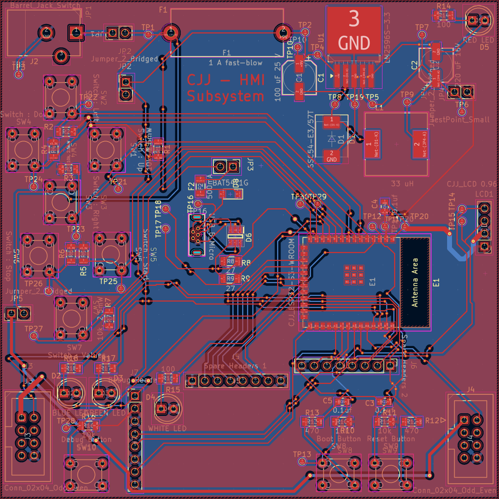
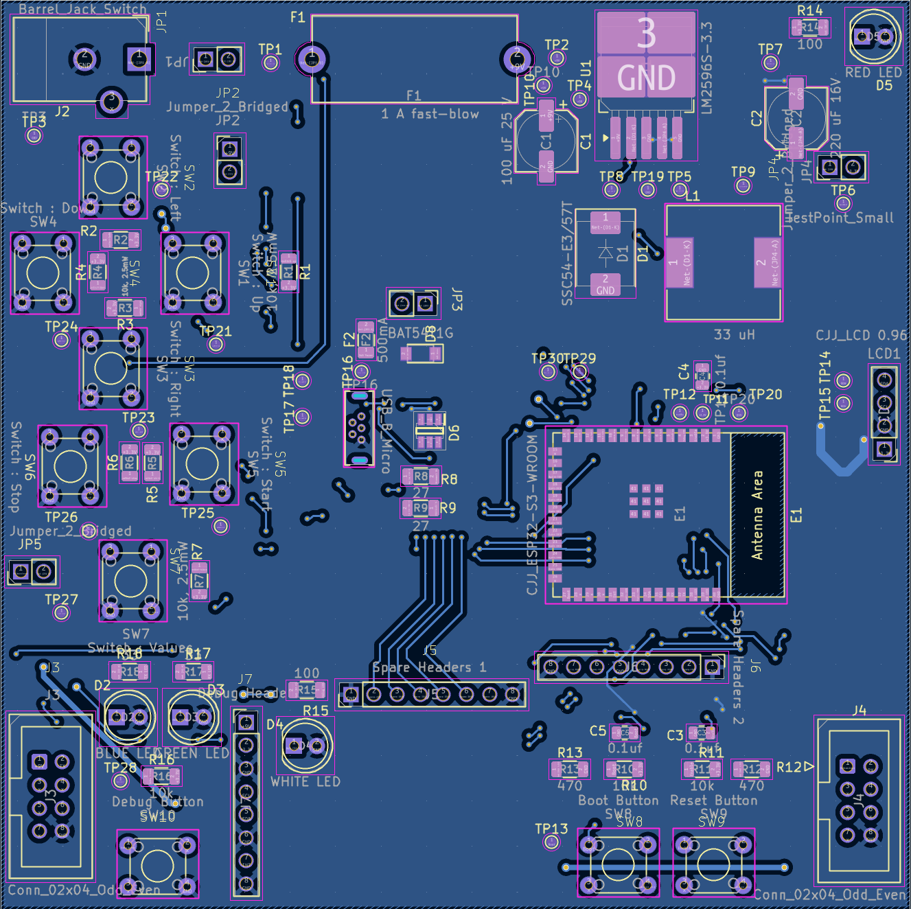

## Overview

This is the HMI subsystem PCB, designed in KiCad as a 2-layer mixed SMD/THT board. The ESP32, regulator, and passives are all SMD. Buttons, LEDs, connectors, and the fuse holder are THT for easier assembly.

## Board Specs

| Property | Value |
|---|---|
| Layers | 2 |
| Technology | Mixed SMD + THT |
| Power Input | 9V DC, 2.1mm barrel jack |
| Regulated Output | 3.3V via LM2596S-3.3 |
| MCU | ESP32-S3-WROOM-1-N4 |
| Display Interface | I2C (SDA/SCL) |
| UART Interface | 2x 8-pin headers (daisy-chain in/out) |
| Programming | USB Micro-B |

## PCB Renders

**Figure 1:** PCB Front

**Figure 2:** PCB Back

## Resources

The PCB is available as a [PDF](PCB-Design-HMI-subsystem.pdf), a [KiCad project zip](Hmi-subsystem.zip), and a [Gerber zip](Christo305.zip) for fabrication.
